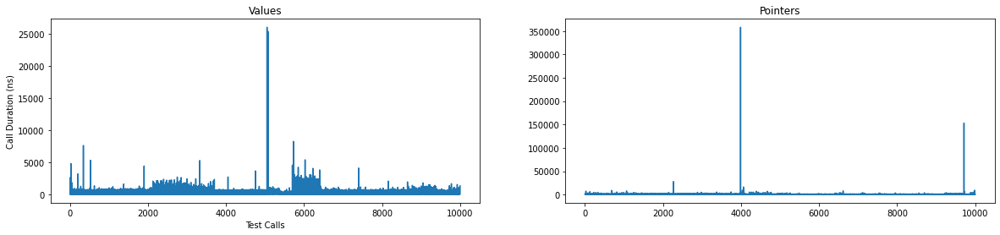
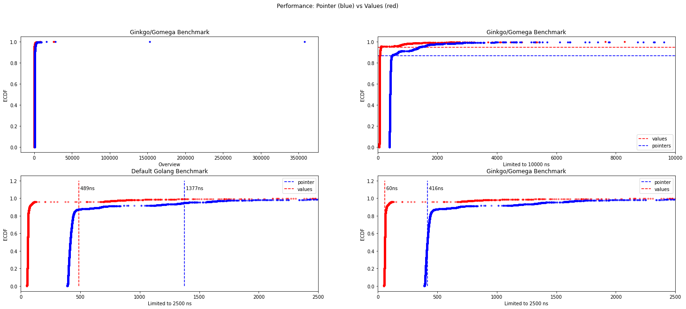

# sliceofpointers
golang performance benchmark

## Question
**What is more performant? A slice of pointers or a slice of values?**  

## Scenario
Go v1.17.8  
Laptop  

## Summary

**Call Durations**  

**ECDF**  

